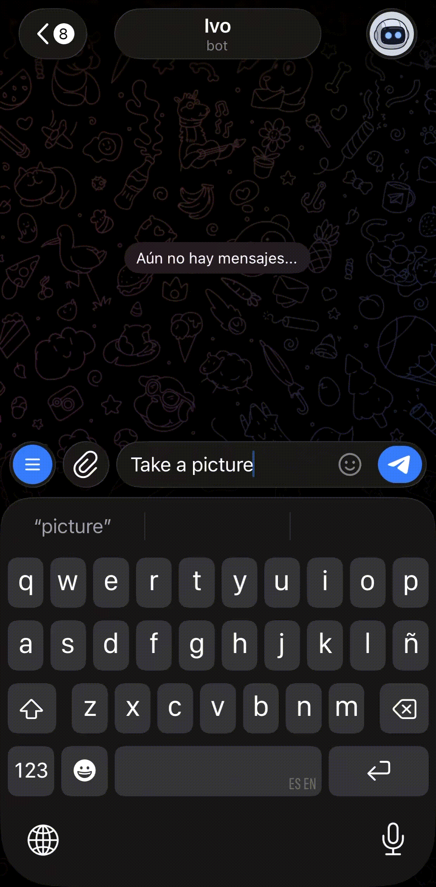

<p align="center">
  
</p>

<h1 align="center">IVO</h1>

<p align="center">
  A tiny Telegram coding assistant that works with GitHub Copilot or free Ollama.
</p>


IVO turns [GitHub Copilot CLI](https://github.com/features/copilot/cli) into a personal assistant you can use from Telegram.
You send a text or voice message, and it can work inside a real workspace: inspect code, edit files, run shell commands, use browser automation, call MCP servers, and reply back through the bot.

You can run it in two clear modes:

- with a **GitHub Copilot** [free/subscription](https://github.com/features/copilot/plans)
- with **Ollama** due to its [**Copilot integration**](https://docs.ollama.com/integrations/copilot-cli)

The recommended path is Ollama Cloud, even on the free tier.

The goal is not to build another huge agent framework.
The goal is to keep the layer above Copilot CLI as small, understandable, and useful as possible.

- Tiny core, easy to audit
- Powered by GitHub Copilot CLI in raw workspace mode
- Telegram-first, with voice in and voice out
- Skills and agents defined in plain Markdown
- Persistent memory per agent or per user
- Works with GitHub Copilot or free Ollama models
- Ollama Cloud recommended as the easiest free setup

Repo: <https://github.com/albertleal/ivo>

## Why IVO exists

Most projects in this space go in one of two directions:

- They become large frameworks with their own runtime, orchestration stack, plugin system, and abstractions.
- They stay tiny, but end up being just a chat relay with no real execution power.

IVO sits in the middle.

It stays small, but it is still a real working assistant because the heavy lifting stays inside GitHub Copilot CLI, which already provides the tool runtime, permissions, workspace access, browser automation, MCP support, and model integration.

IVO only adds what Copilot CLI does not already give you:

- a Telegram interface
- voice notes and spoken replies
- lightweight memory
- Markdown-based skills and agents
- a small HTTP API for notifications and integrations

If Copilot CLI gets better, IVO gets better automatically.

## What it does

From Telegram, you can ask it to:

- audit a repo for secrets, dead code, or obvious issues
- run tests and explain failures
- rewrite docs or code comments
- inspect logs and local processes
- browse the web or use Playwright through Copilot tools
- call MCP servers such as browser, Firecrawl, or Home Assistant
- switch models with slash commands
- answer back in text or speech

This is the core idea: real coding-agent power, but reachable from your phone.

## What it feels like

Two quick demos:

<table>
  <tr>
    <td align="center" width="50%">
      <br />
      First-time workflow: choose adapter and model, speak to IVO, and get the reply in Telegram.
    </td>
    <td align="center" width="50%">
      <br />
      Real agent behavior: when a capability is missing, IVO can build a small tool in the workspace and use it next.
    </td>
  </tr>
</table>

Examples of prompts you can send:

- "audit this repo for obvious secrets and patch the gitignore"
- "run the failing tests, explain the root cause, and fix the smallest safe issue first"
- "find a way to connect to my Home Assistant network and turn off my kitchen lights"

IVO forwards the request to Copilot CLI, coordinates your workspace agents, skills, and MCP integrations, then streams the reply back to Telegram.

It can also be pointed at a wider workspace such as your home directory, so it can move across multiple projects and local files as a tiny personal agent.

## Philosophy

- Keep the core minimal
- Reuse Copilot CLI instead of rebuilding its tools
- Prefer plain files over custom systems
- Make the mobile experience first-class
- Keep everything easy to inspect and customize

## Features

- Telegram interface for your coding assistant
- Copilot CLI as main engine
- Voice input with Whisper
- Voice replies with Kokoro
- GitHub Copilot support for users with a Copilot subscription
- Ollama support for local or cloud models, including a free path
- Skills and agents stored as plain Markdown files in `.github/skills/` and `.github/agents/`
- Persistent memory stored as simple Markdown files
- HTTP API for outbound notifications and automation hooks
- Per-workspace agent loading when you point IVO at a repo
- Dynamic slash commands for discovered model aliases
- Very small Python codebase compared to most agent stacks

## Choose your backend

### GitHub Copilot path

Use this if you already have a GitHub Copilot subscription and want the native Copilot CLI workflow.

### Free Ollama path

Use this if you want to run IVO without paying for Copilot.

Recommended default: Ollama Cloud, even on the free tier.
It is the easiest way to get started without managing large local models, and IVO can still expose those models through the same Telegram interface.

## Why it is different

IVO is not trying to replace Copilot CLI.
It is trying to make Copilot CLI available where it normally is not: Telegram, voice, and lightweight personal automation.

That gives it a different shape:

| Approach | Core engine | Main surface | Complexity | Best for |
| --- | --- | --- | --- | --- |
| Copilot CLI alone | Copilot CLI | Terminal | Low | Users who stay on the laptop |
| Typical Telegram LLM bot | Custom chat wrapper | Telegram | Low | Simple question-answer chat |
| Large agent framework | Custom runtime | Web, desktop, terminal | High | Teams wanting an all-in-one platform |
| IVO | Copilot CLI | Telegram + voice | Very low | People who want a powerful personal assistant without extra framework weight |

If you already use and trust Copilot CLI, IVO gives you a remote control for it, not another stack to maintain.

## Quick start

Before starting, choose one backend:

- Copilot if you already pay for GitHub Copilot
- Ollama if you want the free path
- Ollama Cloud if you want the recommended free path with the least setup friction

### 1. Clone and install

```bash
git clone https://github.com/albertleal/ivo.git
cd ivo
make install
```

The installer creates the virtual environment, installs dependencies, scaffolds local folders, and copies config templates when needed.


### 2. Create a Telegram bot

- Open BotFather in Telegram
- Create a new bot
- Copy the bot token
- Send at least one message to the bot from the Telegram account you want to authorize
- Put the token and your chat ID into `.env` (next step)


### 3. Configure secrets and settings

Edit `.env`:

```env
TELEGRAM_BOT_TOKEN=123:abc
TELEGRAM_CHAT_ID=12345678
```

Edit `config.yaml`:
If you want to be able to chose on the go between ollama and copilot subscription

```yaml
telegram:
  token: ${TELEGRAM_BOT_TOKEN}
  admin_chat_id: ${TELEGRAM_CHAT_ID}

adapters:
  copilot:
    enabled: true
  ollama:
    enabled: true

defaults:
  adapter: copilot
```

If you want ONLY the free Ollama route instead, switch the adapter:

```yaml
adapters:
  copilot:
    enabled: false #Off
  ollama:
    enabled: true

defaults:
  adapter: ollama
```

Same applies for copilot only

```yaml
adapters:
  copilot:
    enabled: true
  ollama:
    enabled: false  #Off

defaults:
  adapter: ollama
```

### 4. Run it

```bash
make run
```

Or:

```bash
python -m ivo --config config.yaml
```

## Prerequisites

- Python 3.11+
- GitHub Copilot CLI installed and authenticated if you use the Copilot path
- `whisper-cli` on your `PATH` if you want speech-to-text
- Kokoro model files if you want text-to-speech
- Ollama installed if you want the Ollama path
- Ollama Cloud is the recommended free option if you do not want to run local models

## Common use cases

### Mobile coding assistant

- Inspect a repo while away from the computer
- Trigger small fixes, audits, or documentation rewrites from Telegram
- Switch models quickly with slash commands

### Voice-driven workflow

- Send a voice note instead of typing long prompts
- Get spoken replies when text is inconvenient

### Personal automation

- Push notifications to Telegram through the HTTP API
- Query logs, monitor a machine, or run maintenance tasks
- Connect MCP servers for browser, home automation, and other tools

## Architecture

IVO is intentionally simple.

```text
Telegram -> Bot handler -> Orchestrator -> Adapter -> Engine -> Model reply
                           |              |          |
                           |              |          +-- Copilot CLI
                           |              |
                           |              +-- Copilot adapter
                           |              +-- Ollama adapter
                           |
                           +-- Skills
                           +-- Memory
                           +-- Sub-agents
                           +-- Session store
```

The important split is:

- the adapter chooses how IVO talks to the backend
- the engine is what actually executes the tool-enabled agent workflow

In practice, Copilot and Ollama are adapter choices, while Copilot CLI is still the engine behind the tool-capable flow.

## Project layout

```text
.github/
├── agents/        Markdown agent definitions
└── skills/        Markdown skills and meta configuration

.ivo/
└── memory/        File-based memory store

ivo/
├── app.py         Main async app
├── config.py      YAML + env config loading
├── orchestrator.py
├── agents.py
├── skills.py
├── memory.py
├── adapters/
├── api/
├── bot/
├── session/
└── utils/
```

## Configuration

Most configuration lives in `config.yaml`. See `config.example.yaml` for the full annotated version.

Main sections:

- `telegram`: bot token, admin chat, polling config
- `api`: HTTP API host, port, IP allowlist
- `adapters`: Copilot and Ollama backends
- `defaults`: initial adapter selection
- `session`: sqlite, json, or in-memory session storage
- `skills`: skill directory and auto-load rules
- `memory`: memory directory, truncation, per-user mode
- `agents`: agent directory, workspace path, front-door agent, delegation depth

## Built-in commands

- `/start` shows status and the active setup
- `/models` lists available models
- `/<alias>` switches model
- `/agents` lists registered agents
- `/voice` toggles voice replies
- `/stop` interrupts the current response
- `/clear` clears chat history

Everything else is treated as a normal prompt.

## Skills, memory, and agents

### Skills

Skills are plain Markdown files. They shape how the assistant behaves without requiring custom code.

### Memory

Memory is file-based and simple by design. The orchestrator injects recent memory into prompts and appends new remembered facts back to disk.

### Agents

Sub-agents are also Markdown files with frontmatter. They let the main assistant delegate specialized tasks without introducing a heavy framework.

Example:

```markdown
---
name: sql-helper
description: Translates plain English into SQL.
adapter: copilot
model: claude-sonnet-4.6
system_prompt_inline: |
  You return a single SQL statement for the user's request.
tools: []
---
```

## Workspace mode

When `agents.workspace_path` is set, IVO loads agents from that workspace's `.github/agents/` and layers them on top of the bundled defaults.

When `memory.use_workspace: true` is also enabled, memory files move into that workspace as well. This makes it easy to bind the bot to a specific repo and give it repo-specific skills, memory, and behavior.

## HTTP API

IVO exposes a small FastAPI server for integrations and outbound notifications.

- `GET /health`
- `GET /models`
- `POST /send`

Swagger UI, ReDoc, and OpenAPI are available when the API is enabled. A static schema is also committed at `docs/openapi.json`.

By default only loopback clients can call the API. You can widen access with `api.allowed_ips` in `config.yaml`.

## How IVO compares

The tradeoff is deliberate.

- If you want a huge agent platform with lots of internal abstractions, IVO is probably too small.
- If you want a Telegram bot that is only a chat wrapper, IVO is probably more capable than necessary.
- If you already use Copilot CLI and want that power available from your phone, IVO is the narrow sweet spot.

## Roadmap

- Better first-run setup flow
- More bundled skills and agent templates
- Stronger multi-session and specialized-agent workflows
- More out-of-the-box MCP integrations
- Better observability around long-running tasks

## Contributing

See [`CONTRIBUTING.md`](CONTRIBUTING.md).

## License

MIT. See [`LICENSE`](LICENSE).
